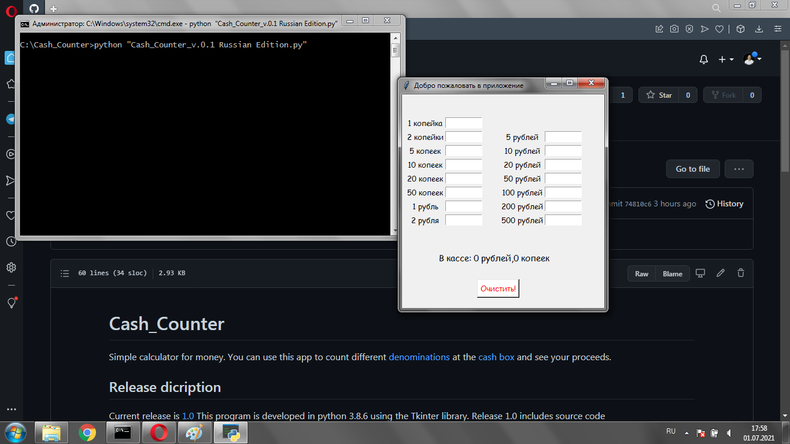

# Cash_Counter

Simple calculator for money. 
You can use this app to count different [denominations](https://lh3.googleusercontent.com/proxy/eoItzo6Pq3MYEF2ZBOE_LJLxXkwQ6Nlw1EeUpoUohVvHMYpXhvGwpW0ApVba_8TJ4KKQKqvaP7lLdMz-J1aC5e__hvhBQhVPzYPverrr6AVOPkwHhQSbK5v2mnB_7JQ) at the [cash box](https://encrypted-tbn0.gstatic.com/images?q=tbn:ANd9GcSfWo95c7fb43NLy_aYO1JfRh06EelQSp4lgA&usqp=CAU) and see your proceeds.

## Release dicription

Current release is [1.0](https://github.com/Andrew-Rand/Cash_Counter.git) 
This program is developed in python 3.8.6 using the Tkinter library.
Release 1.0 includes source code Cash_Counter_v_1_0_Russian.py, which you can run to use this app if you have a Python interpreter. It also includes the dirrectory app, when source code was builded with pyinstaller to independent application which you can run on windows 7, 8, 10 (only x64) (\app\dist\Cash_Counter_v_1_0_Russian.exe) 

## How to use this program with Python interpreter

This is the recommended way to use Cash_Counter.
To start Cash_Counter, whrite into console in this directory:

  python -m Cash_Counter_v_1_0_Russian.py
  

or you can run it by double click in that directory

Скриншот с папки

## How to use this program like independent application

You can use this application without a Python interpreter.
If you have Windows 7, 8 or 10 (x64 OS only), you can run Cash-Counter as an exe file.
You just need to open file /app/dist/Cash_Counter_v_1_0_Russian.exe in your cmd:

Скриншот консоли

or open Cash_Counter_v_1_0_Russian.exe in your favorite file system explorer

Скриншот проводника

## How does the Cash_Counter work

Cash Counter looks like the same window in the picture

скриншот морды приложения

The application window has the cash fields with labels, where you need to write digits, the clear button and the result string.
It works at the real time. Just write some digit in Cash fields and it will be counted.
Pay attention to that russian release supports linguistic cases for words "Рубли" и "Копейки".

3 скриншота с демонстрацией того, как меняются рубли и копейки.

Basically, if you want to start a new calculation, you can close and restart Cash_counter. But you can also use the clear button. After clicking on this red-labeled button, the checkout fields will be cleared and the result will be

  "0 рублей, 0 копеек"
  
And you can start to recruit new cash numbers and they will be recalculated again.

If you write something other than a number in the cache field, the application will interpret it as "0" (zero). Be careful.

#Thank you very much indeed for reading this file.
If you want to improve readme.md or the application, you can send me a [message](xseven693@gmail.com) or clone [this repo](https://github.com/Andrew-Rand/Cash_Counter.git) and send me your Pull Request.

